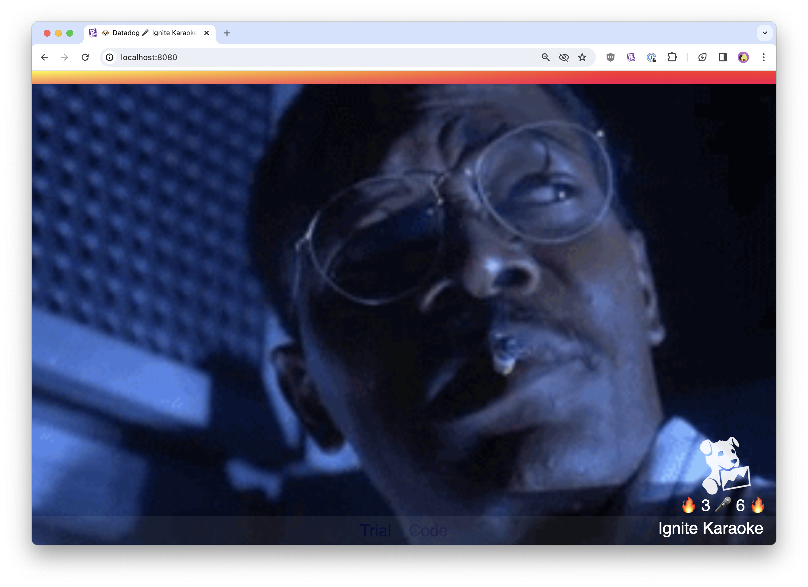
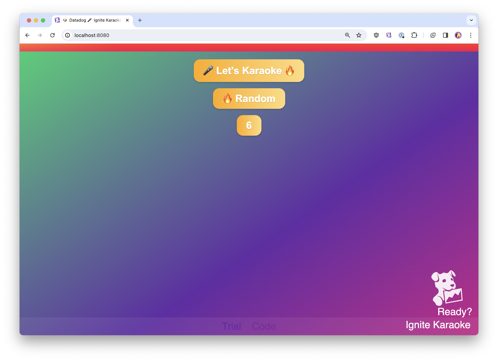

# Javascript Ignite Karaoke App

Simple Javascript slideshow app used for "Ignite Karaoke".

## How to Use This Project

1. Fork this repository.
2. From the root directory, run `python -m http.server 8001` to start a web server on your local machine.
3. Browse to `http://localhost:8001/` in your browser to view the application.

>NOTE: Python must be installed locally.

## Options

### Image Library

- Random (random images from the [images.json](images.json) file)
- Datadog  (random images from the [datadog_images.json](datadog_images.json) file)

### Image Count
There are 3 image count options (3,6, and 9)

